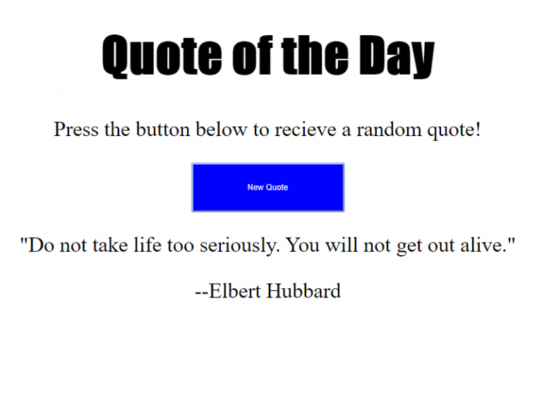

# Quote Generator

# What You Should See
Visit the hosted github page to see this [Quote generator]() in action.

# Project Objective
The objective of this JavaScript project is to wire up a very basic JavaScript quote generator.

It is a very basic project that requires you to know how to code a JavaScript object and put it into an array of objects. The JavaScript array consists of a six different objects, each with two name value pairs. One name-value pair is the author and his or her name, and the other name-value pair is the quote and the actual quote itself.

# JavaScript Used
* Inline JavaScript
* JavaScript objects
* JavaScript selectors
* JavaScript math library

# New Things Learned or Refreshed
Served as a quick reminder. Whenever you're using quotes in your text strings, you have to use the JavaScript escape character ( / )in your code, else, JavaScript will scream error. In other words, instead of using something such as:  `let test = "hello "my" name is Test"` <– This doesn't work You have to use: `let test = "hello \"my\" name is Test"` <– This works! The alternative is to wrap single quotes in double quotes or vice versa, like this: `let test2 = "hello 'my' name is Test"` <– This works, too

